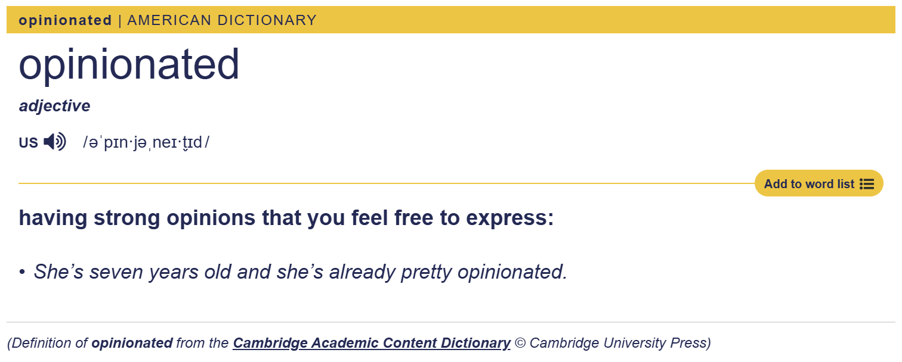

# SignalDash

An `opinionated` way of building a personal financial portfolio.

## Why

`KRW`, which is a fiat for `South Korea` has been "EXTREMELY" volatile in the year of 2020 to 2025.

Exchange rate of `KRW/USD` fluctuated from `1USD/1,104KRW` to `1USD/1,469KRW`.

From late 2020 to late 2025, the value of `1 won` has decreased around 25% from `0.0009 USD` to `0.00068 USD` like below google graph displays.

Why bother even to work when all the inflation comes in?

Without the active and repetitive act of replacing your wage income to financial assets, life will always put a bullet in your head under the name of inflation.

To this end, I propose to build a personal financial portfolio in a "VERY" opinionated way.

## Feature

TBD

## Tech stack

| Section | Details               |
| ------- | --------------------- |
| Client  | `fyne`                |
| Server  | `go (native)`, `gorm` |
| DB      | `sqlite`              |
| Infra   | `none (local binary)` |

## License

MIT.

## Reference

- [U.S. Dollar Index](https://www.tradingview.com/symbols/TVC-DXY/)
